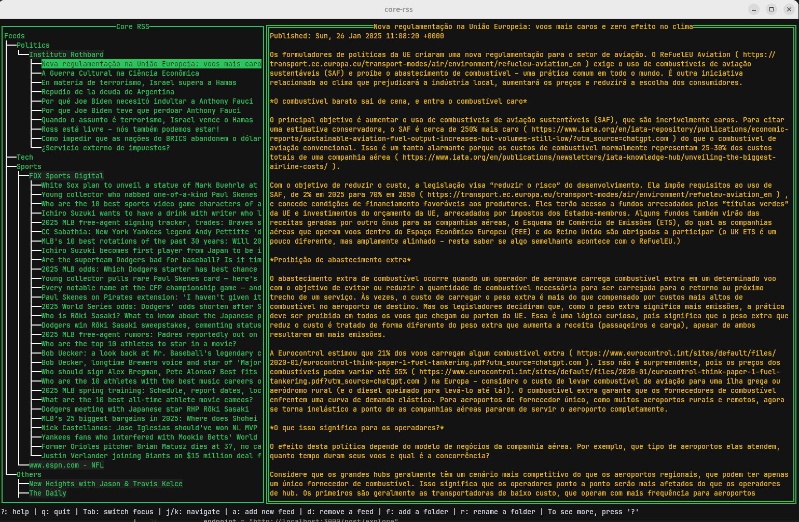

<div align="center">

# Core RSS

A terminal-based RSS feed reader.



</div>

## Installation

1. Go to the Releases section and get the executable file for your system (for now, only Linux is supported).

2. Rename and move the executable file:

   ```bash
   sudo mv core-rss-linux-amd64 /usr/local/bin/core-rss
   sudo chmod +x /usr/local/bin/core-rss
   ```

3. Execute it by typing `core-rss`.

## Building from source

1. Make sure you have Go install (1.23 or later).

2. Clone the repository:

    ```bash
    git clone https://github.com/rzinak/core-rss
    cd core-rss
    ```

3. Build it:

    ```bash
    make build
    ```

4. Install:

    ```bash
    make install
    ```

### Requirements

- Go 1.23 or later;
- Make;

### Usage

Press '?' to see the available commands.
